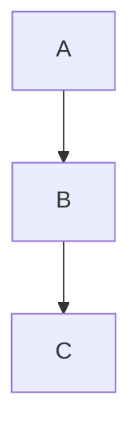

# markdown2 — Comprehensive API Reference

> A fast, complete Python implementation of Markdown with support for 30+ extras (extensions).
> Single-file, pure-Python, no required dependencies. Python 3.9+.

---

## Table of Contents

- [Installation](#installation)
- [Quick Start](#quick-start)
- [The `markdown()` Function](#the-markdown-function)
- [The `markdown_path()` Function](#the-markdown_path-function)
- [The `Markdown` Class](#the-markdown-class)
- [Return Type: `UnicodeWithAttrs`](#return-type-unicodewithattrs)
- [Extras System](#extras-system)
- [Extras Reference](#extras-reference)
  - [admonitions](#admonitions)
  - [alerts](#alerts)
  - [breaks](#breaks)
  - [code-friendly](#code-friendly)
  - [code-syntax-highlighting](#code-syntax-highlighting)
  - [cuddled-lists](#cuddled-lists)
  - [fenced-code-blocks](#fenced-code-blocks)
  - [footnotes](#footnotes)
  - [header-ids](#header-ids)
  - [highlightjs-lang](#highlightjs-lang)
  - [html-classes](#html-classes)
  - [latex](#latex)
  - [link-patterns](#link-patterns)
  - [link-shortrefs](#link-shortrefs)
  - [markdown-file-links](#markdown-file-links)
  - [markdown-in-html](#markdown-in-html)
  - [metadata](#metadata)
  - [middle-word-em](#middle-word-em)
  - [mermaid](#mermaid)
  - [nofollow](#nofollow)
  - [numbering](#numbering)
  - [pyshell](#pyshell)
  - [smarty-pants](#smarty-pants)
  - [strike](#strike)
  - [tables](#tables)
  - [tag-friendly](#tag-friendly)
  - [target-blank-links](#target-blank-links)
  - [tg-spoiler](#tg-spoiler)
  - [toc](#toc)
  - [underline](#underline)
  - [use-file-vars](#use-file-vars)
  - [wavedrom](#wavedrom)
  - [wiki-tables](#wiki-tables)
- [Safe Mode](#safe-mode)
- [Link Patterns](#link-patterns-1)
- [Subclassing and Hooks](#subclassing-and-hooks)
- [CLI Usage](#cli-usage)
- [Optional Dependencies](#optional-dependencies)

---

## Installation

```bash
pip install markdown2
```

With all optional extras:

```bash
pip install markdown2[all]
```

---

## Quick Start

```python
import markdown2

# Simple conversion
html = markdown2.markdown("**Hello** world")

# With extras
html = markdown2.markdown("text", extras=["fenced-code-blocks", "tables"])

# From a file
html = markdown2.markdown_path("README.md")

# Reusable converter
md = markdown2.Markdown(extras=["footnotes", "toc"])
html = md.convert("# Title\n\nBody text")
print(html.toc_html)  # table of contents HTML
```

---

## The `markdown()` Function

```python
markdown2.markdown(
    text: str,
    html4tags: bool = False,
    tab_width: int = 4,
    safe_mode: bool | str | None = None,
    extras: list[str] | dict[str, Any] | None = None,
    link_patterns: Iterable[tuple[re.Pattern, str | Callable]] | None = None,
    footnote_title: str | None = None,
    footnote_return_symbol: str | None = None,
    use_file_vars: bool = False,
    cli: bool = False,
) -> UnicodeWithAttrs
```

Converts a markdown string to HTML. Returns a `UnicodeWithAttrs` string (see below).

### Parameters

| Parameter | Type | Default | Description |
|-----------|------|---------|-------------|
| `text` | `str` | required | Markdown source text |
| `html4tags` | `bool` | `False` | Use HTML4 self-closing tags (`>`) instead of XHTML (` />`) |
| `tab_width` | `int` | `4` | Number of spaces per tab for code blocks and list indentation |
| `safe_mode` | `bool \| str \| None` | `None` | HTML sanitization mode (see [Safe Mode](#safe-mode)) |
| `extras` | `list \| dict \| None` | `None` | Extensions to enable (see [Extras System](#extras-system)) |
| `link_patterns` | `Iterable \| None` | `None` | Auto-linking patterns (see [Link Patterns](#link-patterns-1)) |
| `footnote_title` | `str \| None` | `None` | Title for footnote backlinks. Use `%d` for footnote number |
| `footnote_return_symbol` | `str \| None` | `None` | Symbol for footnote return links (default: `↩`) |
| `use_file_vars` | `bool` | `False` | Parse Emacs-style file variables for extras config |
| `cli` | `bool` | `False` | Internal flag for CLI usage |

### Example

```python
html = markdown2.markdown(
    "# Hello\n\nA paragraph with **bold**.",
    extras={"fenced-code-blocks": None, "tables": None},
    safe_mode="escape",
)
```

---

## The `markdown_path()` Function

```python
markdown2.markdown_path(
    path: str,
    encoding: str = "utf-8",
    html4tags: bool = False,
    tab_width: int = 4,
    safe_mode: bool | str | None = None,
    extras: list[str] | dict[str, Any] | None = None,
    link_patterns: Iterable[tuple[re.Pattern, str | Callable]] | None = None,
    footnote_title: str | None = None,
    footnote_return_symbol: str | None = None,
    use_file_vars: bool = False,
) -> UnicodeWithAttrs
```

Reads a markdown file and converts it to HTML. Same parameters as `markdown()` plus `encoding`.

```python
html = markdown2.markdown_path("docs/guide.md", encoding="utf-8", extras=["tables"])
```

---

## The `Markdown` Class

Use this when converting multiple documents with the same settings — avoids re-initializing extras each time.

```python
class markdown2.Markdown(
    html4tags: bool = False,
    tab_width: int = 4,
    safe_mode: bool | str | None = None,
    extras: list[str] | dict[str, Any] | None = None,
    link_patterns: Iterable[tuple[re.Pattern, str | Callable]] | None = None,
    footnote_title: str | None = None,
    footnote_return_symbol: str | None = None,
    use_file_vars: bool = False,
    cli: bool = False,
)
```

### Methods

| Method | Description |
|--------|-------------|
| `convert(text: str) -> UnicodeWithAttrs` | Convert markdown text to HTML |
| `reset()` | Reset internal state (called automatically between `convert()` calls) |
| `preprocess(text: str) -> str` | Hook for subclasses — called early in conversion |
| `postprocess(text: str) -> str` | Hook for subclasses — called late in conversion |
| `header_id_from_text(text, prefix, n) -> str` | Generate header IDs — override for custom ID scheme |

### Example

```python
md = markdown2.Markdown(extras=["footnotes", "fenced-code-blocks", "tables"])

html1 = md.convert("# Doc 1\n\nContent here")
html2 = md.convert("# Doc 2\n\nMore content")
```

---

## Return Type: `UnicodeWithAttrs`

All conversion functions return a `UnicodeWithAttrs` — a `str` subclass that may carry extra attributes depending on which extras are enabled.

| Attribute | Set By Extra | Type | Description |
|-----------|-------------|------|-------------|
| `.toc_html` | `toc` | `str` | Generated table of contents as HTML |
| `.metadata` | `metadata` | `dict` | Parsed YAML-like metadata from document header |

```python
result = markdown2.markdown(text, extras=["toc", "metadata"])
print(result)            # the HTML string
print(result.toc_html)   # table of contents
print(result.metadata)   # {"title": "My Doc", "author": "Name", ...}
```

---

## Extras System

Extras are optional extensions that add features beyond standard Markdown. Enable them by name.

### Enabling Extras

**As a list** (no configuration needed):

```python
extras = ["fenced-code-blocks", "tables", "footnotes"]
```

**As a dict** (with per-extra configuration):

```python
extras = {
    "fenced-code-blocks": None,
    "header-ids": {"prefix": "sec-"},
    "html-classes": {"table": "striped", "img": "responsive"},
    "breaks": {"on_newline": True},
}
```

**Via Emacs-style file variables** (with `use_file_vars=True`):

```markdown
<!-- -*- markdown-extras: footnotes,tables -*- -->
# Document starts here
```

---

## Extras Reference

### admonitions

RST-style admonitions (callout boxes).

**Syntax:**

```markdown
!!! note "Optional Title"
    Admonition body text.
    Can be multiple lines.
```

**Supported types:** `attention`, `caution`, `danger`, `error`, `hint`, `important`, `note`, `tip`, `warning`

**Output:**

```html
<div class="admonition note">
<p class="admonition-title">Optional Title</p>
<p>Admonition body text. Can be multiple lines.</p>
</div>
```

---

### alerts

GitHub-style alerts (blockquote callouts).

**Syntax:**

```markdown
> [!NOTE]
> Useful information.

> [!WARNING]
> Critical warning.
```

**Supported types:** `NOTE`, `TIP`, `IMPORTANT`, `WARNING`, `CAUTION`

**Output:**

```html
<div class="markdown-alert markdown-alert-note" role="alert">
<p class="markdown-alert-title">Note</p>
<p>Useful information.</p>
</div>
```

---

### breaks

Control hard line break behavior.

**Options:**

| Option | Type | Default | Description |
|--------|------|---------|-------------|
| `on_newline` | `bool` | `False` | Convert single newlines to `<br>` (GFM-style) |
| `on_backslash` | `bool` | `False` | Convert `\` at end of line to `<br>` |

```python
extras = {"breaks": {"on_newline": True}}
```

---

### code-friendly

Disables `_` and `__` as emphasis markers. Useful when writing about code with underscored identifiers like `my_var` or `__init__`.

```python
extras = ["code-friendly"]
```

With this extra, `some_function_name` renders as literal text rather than `some<em>function</em>name`.

---

### code-syntax-highlighting

Adds syntax highlighting to fenced code blocks using [Pygments](https://pygments.org/).

**Requires:** `pygments>=2.7.3` (install with `pip install markdown2[all]` or `pip install pygments`)

Works automatically with `fenced-code-blocks` — when a language is specified on a fenced block, Pygments colorizes the output.

```python
extras = ["fenced-code-blocks", "code-syntax-highlighting"]
```

---

### cuddled-lists

Allows lists to start immediately after a paragraph without a blank line separator.

```markdown
This is a paragraph.
- item 1
- item 2
```

Without this extra, the list would be treated as part of the paragraph.

---

### fenced-code-blocks

Enables triple-backtick code blocks (GitHub-style).

**Syntax:**

````markdown
```python
def hello():
    print("Hello, world!")
```
````

The language identifier after the opening backticks is optional. When provided, it sets the `class` attribute on the `<code>` element and enables syntax highlighting if `code-syntax-highlighting` is also active.

**Output:**

```html
<pre><code class="python">def hello():
    print(&quot;Hello, world!&quot;)
</code></pre>
```

---

### footnotes

Adds footnote support (PHP Markdown Extra style).

**Syntax:**

```markdown
This has a footnote[^1] and another[^note].

[^1]: First footnote content.
[^note]: Named footnote content.
    Can span multiple paragraphs when indented.
```

**Configuration:**

| Parameter | Default | Description |
|-----------|---------|-------------|
| `footnote_title` | `"Jump back to footnote %d in the text."` | Title attribute for backlinks (`%d` = footnote number) |
| `footnote_return_symbol` | `"↩"` (↩) | Symbol for the return link |

```python
md = markdown2.Markdown(
    extras=["footnotes"],
    footnote_title="See footnote %d",
    footnote_return_symbol="⤴",
)
```

---

### header-ids

Adds `id` attributes to header elements for linking.

**Options:**

| Option | Type | Default | Description |
|--------|------|---------|-------------|
| `prefix` | `str` | `""` | Prefix for generated IDs |
| `mixed` | `bool` | `False` | Allow mixed-case IDs (default lowercases) |
| `reset-count` | `bool` | `True` | Reset duplicate counter between conversions |

```python
extras = {"header-ids": {"prefix": "sec-"}}
```

**Input:** `## My Section`
**Output:** `<h2 id="sec-my-section">My Section</h2>`

Duplicate headers get numeric suffixes: `my-section`, `my-section-1`, `my-section-2`.

---

### highlightjs-lang

Uses `language-LANG` class format on code blocks for compatibility with [highlight.js](https://highlightjs.org/) instead of the default Pygments format.

```python
extras = ["fenced-code-blocks", "highlightjs-lang"]
```

**Output:** `<code class="language-python">` instead of `<code class="python">`

---

### html-classes

Adds custom CSS classes to generated HTML elements.

**Options:** A dict mapping tag names to class strings.

| Supported Tags |
|---------------|
| `img`, `table`, `thead`, `pre`, `code`, `ul`, `ol`, `p` |

```python
extras = {
    "html-classes": {
        "table": "table table-striped",
        "img": "img-fluid",
        "pre": "highlight",
        "ul": "list-unstyled",
    }
}
```

**Output:** `<table class="table table-striped">` etc.

---

### latex

Converts LaTeX math expressions to MathML.

**Requires:** `latex2mathml` (install with `pip install latex2mathml`)

**Syntax:**

```markdown
Inline math: $E = mc^2$

Display math:
$$
\int_0^\infty e^{-x} dx = 1
$$
```

---

### link-patterns

Auto-links text matching regex patterns. Requires the `link_patterns` parameter on the converter.

```python
import re

link_patterns = [
    (re.compile(r"#(\d+)"), r"https://github.com/org/repo/issues/\1"),
    (re.compile(r"\bCVE-\d{4}-\d+\b"), r"https://cve.mitre.org/cgi-bin/cvename.cgi?name=\g<0>"),
]

html = markdown2.markdown(
    "Fix for #42 and CVE-2024-1234",
    extras=["link-patterns"],
    link_patterns=link_patterns,
)
```

Each pattern is a `(compiled_regex, replacement)` tuple. The replacement can be a string (with regex group references) or a callable that receives the match object and returns a URL.

---

### link-shortrefs

Enables shortcut reference links. `[text]` is treated as `[text][]` if a matching link definition exists.

```markdown
[Python] is great.

[Python]: https://python.org
```

---

### markdown-file-links

Converts `.md` file links to `.html` links in the output.

**Options:**

| Option | Type | Default | Description |
|--------|------|---------|-------------|
| `link_defs` | `bool` | `True` | Also apply to link reference definitions |

```markdown
See [the guide](guide.md) for details.
<!-- becomes: <a href="guide.html">the guide</a> -->
```

---

### markdown-in-html

Processes markdown inside HTML block elements that have the `markdown="1"` attribute.

```markdown
<div class="note" markdown="1">
This is **markdown** inside an HTML block.

- List item 1
- List item 2
</div>
```

---

### metadata

Extracts YAML-like metadata from the beginning of the document. The metadata is available on the result's `.metadata` attribute.

**Syntax (fenced):**

```markdown
---
title: My Document
author: Jane Doe
tags:
  - python
  - markdown
---

# Content starts here
```

**Syntax (unfenced):**

```markdown
title: My Document
author: Jane Doe

# Content starts here
```

The unfenced form ends at the first blank line.

```python
result = markdown2.markdown(text, extras=["metadata"])
print(result.metadata)
# {"title": "My Document", "author": "Jane Doe", "tags": ["python", "markdown"]}
```

---

### middle-word-em

Controls whether emphasis markers inside words are processed.

**Options:**

| Option | Type | Default | Description |
|--------|------|---------|-------------|
| `allowed` | `bool` | `True` | If `False`, `some_var_name` is not treated as emphasis |

```python
extras = {"middle-word-em": {"allowed": False}}
```

---

### mermaid

Renders fenced code blocks with language `mermaid` as Mermaid diagram containers.

````markdown

````

**Output:**

```html
<pre class="mermaid-pre"><code class="mermaid">
graph TD
    A --> B
    B --> C
</code></pre>
```

You still need to include the [Mermaid.js](https://mermaid.js.org/) library in your HTML page for rendering.

---

### nofollow

Adds `rel="nofollow"` to all `<a>` tags in the output. Useful for user-generated content.

```python
extras = ["nofollow"]
```

---

### numbering

Generic numbering system for figures, tables, equations, etc.

**Syntax:**

```markdown
[#fig My Figure Caption @my-fig]

See [@my-fig] for details.
```

- `#counter` — defines a numbered item with counter name `fig`
- `@id` — assigns a referenceable ID
- `[@id]` — references a numbered item

---

### pyshell

Formats Python interactive shell sessions as code blocks. Detects lines starting with `>>>` and `...` (unindented).

```markdown
>>> x = 1 + 2
>>> print(x)
3
```

---

### smarty-pants

Smart typography — converts ASCII punctuation to typographic equivalents.

| Input | Output | Description |
|-------|--------|-------------|
| `'text'` | `'text'` | Curly single quotes |
| `"text"` | `"text"` | Curly double quotes |
| `--` | `–` | En dash |
| `---` | `—` | Em dash |
| `...` | `…` | Ellipsis |

---

### strike

Strikethrough text using double tildes.

**Syntax:** `~~deleted text~~`

**Output:** `<s>deleted text</s>`

---

### tables

GitHub Flavored Markdown (GFM) style tables.

**Syntax:**

```markdown
| Header 1 | Header 2 | Header 3 |
|----------|:--------:|---------:|
| left     | center   | right    |
| cell     | cell     | cell     |
```

Column alignment is controlled by colons in the separator row:
- `---` or `:---` — left aligned (default)
- `:---:` — center aligned
- `---:` — right aligned

---

### tag-friendly

Requires a space after `#` for headers. Prevents `#hashtag` from being treated as a header.

Without this extra: `#hello` → `<h1>hello</h1>`
With this extra: `#hello` → `#hello` (literal text)

---

### target-blank-links

Adds `target="_blank"` and `rel="noopener"` to all links.

```python
extras = ["target-blank-links"]
```

---

### tg-spoiler

Telegram-style spoiler text.

**Syntax:** `||hidden text||`

**Output:** `<tg-spoiler>hidden text</tg-spoiler>`

---

### toc

Generates a table of contents from headers. The TOC HTML is available on the result's `.toc_html` attribute.

**Options:**

| Option | Type | Default | Description |
|--------|------|---------|-------------|
| `depth` | `int` | `6` | Maximum header depth to include (1–6) |
| `prepend` | `bool` | `False` | Prepend TOC to the output HTML |

**Note:** Automatically enables `header-ids` if not already enabled.

```python
extras = {"toc": {"depth": 3}}

result = markdown2.markdown(text, extras=extras)
print(result.toc_html)
# <ul>
#   <li><a href="#section-1">Section 1</a>
#     <ul><li><a href="#subsection">Subsection</a></li></ul>
#   </li>
# </ul>
```

---

### underline

Underline text using double hyphens.

**Syntax:** `--underlined text--`

**Output:** `<u>underlined text</u>`

---

### use-file-vars

Parses Emacs-style file variables to configure extras from within the document itself.

```markdown
<!-- -*- markdown-extras: footnotes,tables -*- -->

# My Document
```

Can also be enabled via the `use_file_vars=True` parameter instead of listing it as an extra.

---

### wavedrom

Renders fenced code blocks with language `wavedrom` as WaveDrom digital timing diagrams.

**Requires:** `wavedrom` (install with `pip install wavedrom`)

**Options:**

| Option | Type | Default | Description |
|--------|------|---------|-------------|
| `prefer_embed_svg` | `bool` | `True` | Embed SVG directly vs. use script tags |

````markdown
```wavedrom
{"signal": [{"name": "clk", "wave": "p...."}]}
```
````

---

### wiki-tables

Google Code Wiki-style tables.

**Syntax:**

```markdown
||Header 1||Header 2||
||cell 1  ||cell 2  ||
```

---

## Safe Mode

Controls how raw HTML in the markdown source is handled. Important for user-generated content.

| Value | Behavior |
|-------|----------|
| `None` (default) | All HTML passes through unmodified |
| `"escape"` | Escapes HTML meta characters (`<` → `&lt;`, `>` → `&gt;`, `&` → `&amp;`) |
| `"replace"` | Replaces HTML blocks with `[HTML_REMOVED]` |
| `True` | Legacy — treated as `"replace"` |

```python
# Escape HTML for display
html = markdown2.markdown(user_input, safe_mode="escape")

# Strip HTML entirely
html = markdown2.markdown(user_input, safe_mode="replace")
```

---

## Link Patterns

Auto-link text matching regex patterns. Requires both the `link-patterns` extra and the `link_patterns` parameter.

```python
import re

patterns = [
    # Bug references: "bug 1234" → link to tracker
    (re.compile(r"bug\s+(\d+)", re.I), r"https://bugs.example.com/\1"),

    # Commit SHAs
    (re.compile(r"\b([0-9a-f]{7,40})\b"), r"https://github.com/org/repo/commit/\1"),

    # Custom callable replacement
    (re.compile(r"@(\w+)"), lambda m: f"https://github.com/{m.group(1)}"),
]

html = markdown2.markdown(text, extras=["link-patterns"], link_patterns=patterns)
```

---

## Subclassing and Hooks

Extend `Markdown` for custom processing:

```python
class MyMarkdown(markdown2.Markdown):
    # Set default extras for all instances
    extras = {"footnotes": None, "tables": None}

    def preprocess(self, text):
        """Called early in conversion — modify raw markdown text."""
        text = text.replace("COMPANY_NAME", "Acme Corp")
        return text

    def postprocess(self, text):
        """Called late in conversion — modify output HTML."""
        return text

    def header_id_from_text(self, text, prefix, n):
        """Custom header ID generation."""
        return f"h-{text.lower().replace(' ', '-')}"
```

---

## CLI Usage

```bash
markdown2 [OPTIONS] [FILE...]
```

### Options

| Flag | Description |
|------|-------------|
| `--version` | Show version |
| `-v, --verbose` | Debug logging |
| `--encoding ENCODING` | Text encoding (default: utf-8) |
| `--html4tags` | Use HTML4-style self-closing tags |
| `-s MODE, --safe MODE` | Safe mode: `escape` or `replace` |
| `-x EXTRAS, --extras EXTRAS` | Extras to enable (comma-separated) |
| `--use-file-vars` | Parse Emacs file variables |
| `--link-patterns-file FILE` | Load link patterns from file |
| `--output FILE` | Write output to file |

### Examples

```bash
# Basic conversion
markdown2 input.md > output.html

# With extras
markdown2 -x footnotes,tables,fenced-code-blocks input.md

# With extra options
markdown2 -x "html-classes={pre:highlight}" input.md

# Safe mode
markdown2 --safe escape untrusted.md

# From stdin
echo "**bold**" | markdown2
```

---

## Optional Dependencies

| Package | Required By Extra | Install |
|---------|------------------|---------|
| `pygments>=2.7.3` | `code-syntax-highlighting` | `pip install pygments` |
| `latex2mathml` | `latex` | `pip install latex2mathml` |
| `wavedrom` | `wavedrom` | `pip install wavedrom` |

Install all optional dependencies:

```bash
pip install markdown2[all]
```
